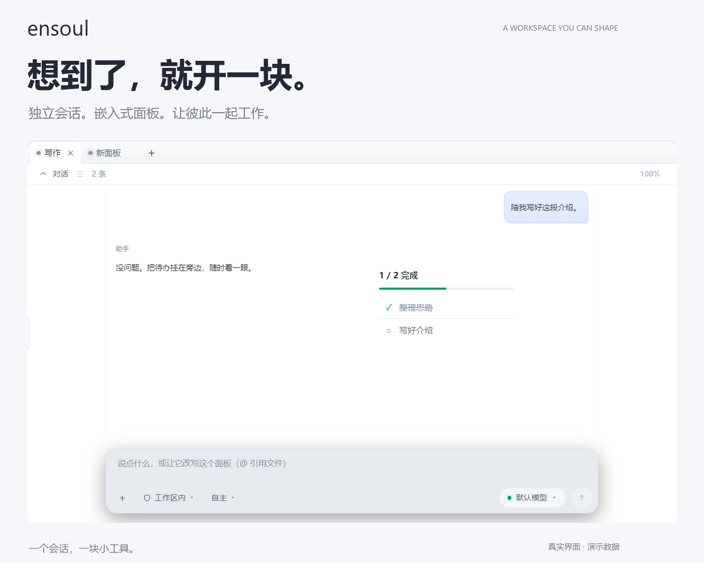
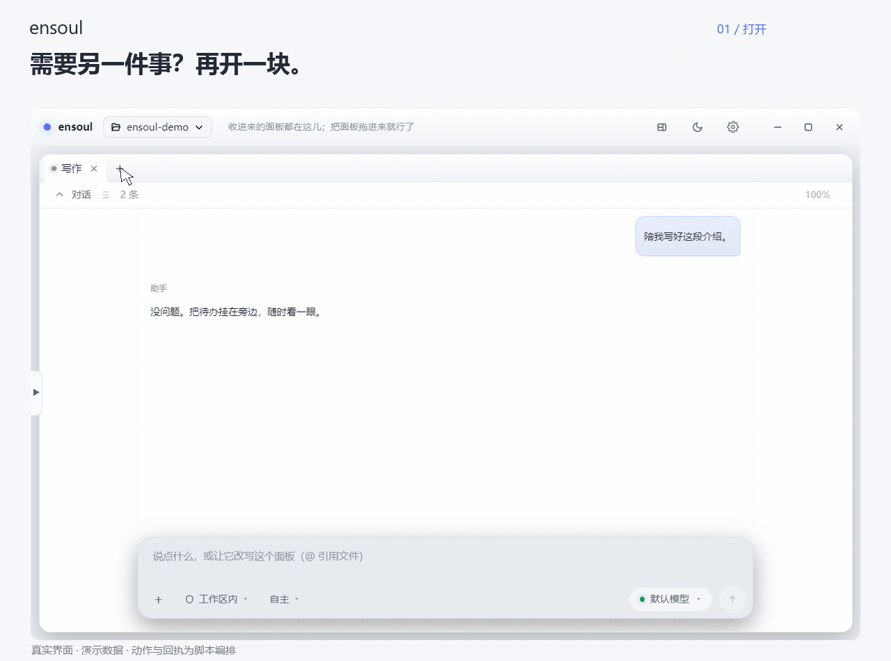
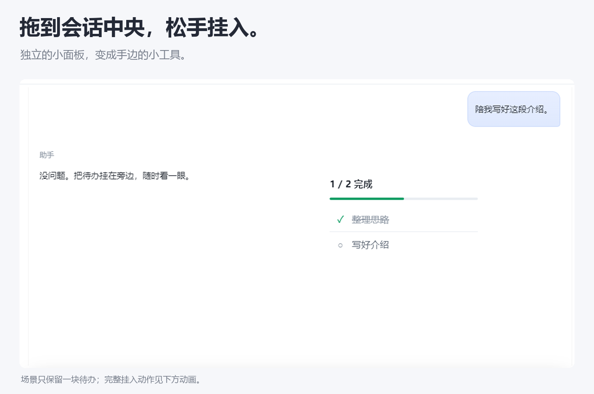
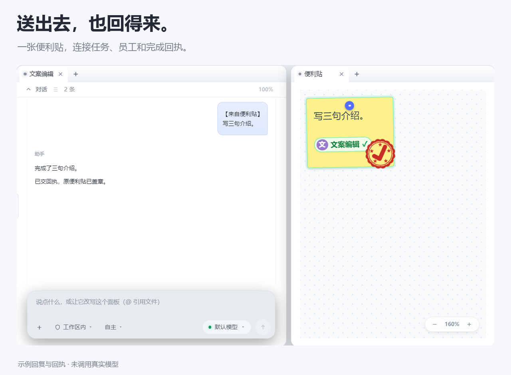

# ensoul

> **简体中文** | [English](README.en.md)

**随手开一块面板，把工具嵌进会话，让面板彼此协作。**



[看核心体验](#看一遍感受面板怎样一起工作) · [快速开始](#快速开始) · [开发与扩展](#开发与扩展) · [开源许可](#开源协议)

## 看一遍，感受面板怎样一起工作

想到另一件事，点一下「＋」就有一块新面板。把常用小工具嵌进会话区域，再把便利贴上的事情拖给 AI 员工。任务进入他的会话，成果交回来，原便利贴盖上完成章。



*真实界面、示例数据、脚本编排。新建、落点提示与便签投递使用现有前端交互；布局和完成回执使用演示状态，光标与拖动轨迹为合成动画。未调用真实模型，动画时长不代表生成耗时。* [观看更流畅的 30 帧 MP4](docs/assets/showcase/demo.mp4)

## 随手开一块，不必先决定它是什么

面板是一块可以继续生长的空间：有自己的会话、模型和上下文。想到新问题，就开一块；要同时做几件事，就分栏；想临时腾位置，就叠成标签或拖成独立窗口。

你也可以直接告诉它：“把这块面板改成专注钟。”从现成面板和插件起步，再通过对话调整规格或修改功能代码。布局、功能和会话可以一起留下来，不用每次重新搭工作台。

## 面板里，还能住着面板

正在写东西时，把一块待办面板拖到会话中央，松手挂入。小面板可以去掉外框，只留下自己的内容；主面板继续对话，待办始终在手边。



这些小工具仍然是独立面板，保留自己的功能与会话。当前实现依附会话所在的标签组区域，随区域布局变化一起放置。常用面板也能收进顶部组件区，或通过组件包导入、导出。

## 面板之间，工作接得起来

便利贴可以成为任务入口，员工会话可以接收任务，完成结果可以回到原来的便利贴。它们通过工具与插件连接成一次协作。

**写一张便利贴 → 拖给左侧员工 → 员工会话收到原话 → 完成后原卡盖章。** 原卡保留任务与负责人，双击已完成的卡片可跳到对应工作。



在这个例子里，面板间通信有一个看得见的结果：你在哪里写下任务，就在哪里看到它完成。

| 体验 | 对应能力 |
| --- | --- |
| 想到什么就开一块 | 独立会话与上下文；分别选择模型、思考水平 |
| 让工具待在会话里 | 依附会话区域的嵌入挂件，可只保留核心内容 |
| 把事情交给其他面板 | 便利贴派单、员工会话、任务状态与回执 |
| 随时改变工作台 | 分栏、标签组、独立浮窗、组件收纳与组件包 |
| 继续增加功能 | 插件工具与插件面板，技能说明按需加载 |

主题、配色、字体与缩放可以在设置中调整。

## 功能来自插件，组合留给你

仓库内已包含番茄钟、任务清单、便签、计费与用量统计、浏览器、任务派发等插件。插件可以提供工具、状态、设置页和自己的面板界面；技能则把操作知识按需交给模型。

扩展功能的顺序是：**先用插件，再用现成面板类型，需要时补充通用运行时能力。** 一种新工具，不必重新发明一套窗口机制。

ensoul 基于 **Electron + React + TypeScript + Node.js**。面板会话可以使用不同的模型提供方；后端也有 [RPC / 守护进程入口](docs/rpc.md)。

目前为 **0.1.x 持续开发版本**，以源码构建运行。本文展示的是当前仓库已有的面板与插件能力；桌面组件暂停开发，暂不列为可用特性。复杂功能改写的结果取决于模型与扩展能力。

## 快速开始

下载源码后，首次运行使用安装入口，它会准备环境并启动应用：

- **Windows**：双击根目录的 `安装.cmd`。
- **macOS**：双击根目录的 `安装.command`。从 ZIP 下载后如果没有执行权限，先在项目目录运行 `chmod +x *.command`。

安装入口会复用已有的 Node.js 22+；没有合适版本时，从 Node.js 官方下载便携环境到项目的 `.runtime/`，无需全局安装或管理员权限。随后安装 npm 依赖、准备本机 Electron、构建并启动。首次需要联网，支持 `HTTPS_PROXY`，支持常规代理环境。下载或构建失败会显示具体错误。

以后使用 `启动.cmd` / `启动.command`，日常启动不重装依赖。安装目录、依赖和构建产物不随 Git 分发；换电脑后重新运行安装入口即可。

已经有 **Node.js 22+** 和 **npm**，也可以使用命令行：

```bash
git clone https://github.com/kafnosake/Ensoul.git
cd Ensoul
npm run setup
npm run app
```

`npm run setup` 统一安装依赖、检查 Electron 并构建；`npm run app` 使用已构建产物。安装成功后不会重复构建来启动；日常根目录启动器仍通过 `scripts/launch.js` 构建最新源码再打开。

第一次打开时：

1. 在左上角选择工作区。
2. 打开 **设置 → 模型**，添加提供方，配置 API 地址、密钥与模型目录。
3. 新建一个对话面板，在输入框旁选择模型。
4. 试着说：“帮我整理今天的任务。”也可以从新建菜单直接添加番茄钟或任务清单，再打开该面板的会话继续调整。

## 开发与扩展

| 入口 | 用途 |
| --- | --- |
| [开发指南](docs/development.md) | 定位入口、代码边界与按范围应用更新 |
| [插件规范](docs/plugin-spec.md) | 工具、状态、设置页与插件面板接入 |
| [文件写入规则](docs/file-write-safety.md) | 多面板协作中的租约与冲突处理 |
| [持久任务](docs/reliable-tasks.md) | 请求编号、异步派单、取消与恢复 |
| [运行时加固](docs/runtime-hardening.md) | 已实现的运行时机制与当前限制 |
| [调度规划](docs/agent-scheduling.md) / [架构审查](docs/architecture-review.md) | 后续目标与已确认的技术债 |
| [展示素材说明](docs/showcase.md) | 封面、演示视频、素材来源与重制方法 |

```bash
npm run dev              # 渲染层开发服务器
npm run build:main       # 编译主进程与 preload
npm run build:renderer   # 构建渲染层
npm run test:runtime     # 运行时回归，适合相关代码变更
```

应用插件的后端放在 `plugins/<名称>/index.js`，界面可放在同目录的 `panel.tsx` / `panel.css`，状态写入 `.ensoul/state/`。工作区插件的动态 UI 加载仍有限制，具体见插件规范。运行状态、私人会话和模型密钥不属于仓库展示素材。

## 开源协议

[MIT](LICENSE)

---

*介绍页由chatgpt6.1sol生成。*
