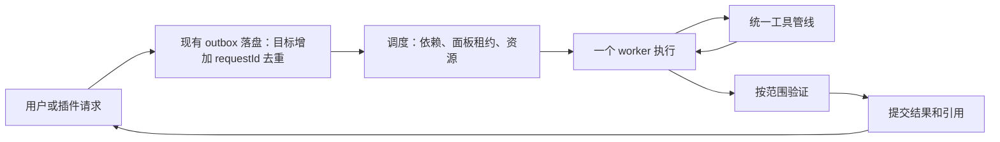

# 面板 agent 调度方案

2026-10-05。本文件是渐进目标，不是全部已实现的 API。第一批 runId 租约、取消链、PTC 与构建协调见 [runtime-hardening.md](runtime-hardening.md)；第二批持久 taskId / requestId、异步派单与恢复见 [reliable-tasks.md](reliable-tasks.md)。以下 verifying、waiting_dependency、attempt、ownerPaths 等仍是目标；当前 completed、文件交付与用户验收分别记录。保留面板、插件和文件状态体系，复用 outbox、steering、派单令牌与 turn journal。

## 1. 面板是产品单位，执行任务是内部记录

一块面板拥有自己的身份、配置、会话和模型选择；它不需要一直运行 LLM。番茄钟倒计时、桌宠动画、账本展示用普通代码运行，只有用户要求修改、解释或触发一个 agent 任务时调用模型。

面板移到侧栏、浮窗或嵌入其他面板，只改变显示关系。隐藏边框不复制 agent，不转移状态所有权。克隆功能实例才创建新身份；同一面板显示在多个宿主时仍只有一个执行所有者。

上述是产品目标。当前 `PanelFloat.anchor` 绑定标签组区域，尚不是任意面板内部的递归插槽；同一面板多宿主显示也需要另行实现。后续真正的面板内嵌应由通用宿主插槽处理父子关系、唯一位置、循环检查和尺寸约束；不要由番茄钟或桌宠插件各自增加窗口机制。

内部最少区分四个 ID：`panelId`（长期会话）、`taskId`（这件事）、`runId`（一次执行尝试）、`toolCallId`（一次工具操作）。增加 `requestId` 去重用户提交 / 派单，`parentTaskId` 建立取消关系。现有派单 token 可以作为任务关联键，避免再造平行令牌系统。

## 2. 默认调度路径



小修复默认一个 worker。只有独立读取或互不重叠的修改，才派多个 worker。不要为了一个按钮依次经过“经理 → 架构师 → 开发 → 审核”四次模型转述。

自动化规则、已有成功任务类型、明确能力匹配优先直接路由；目标含糊或跨域时才使用 LLM 路由。现有员工 / 部门 UI 可以保留，内部调度不必强制组织层级。

工作流是否完成由验收结果决定，不能从回复中出现“完成”或从副作用登记成功推断。只读调查可以返回证据结论；写代码任务还需列改动和适当的验证。

## 3. 一个面板同时只有一个活动 run

复用 `running`，把当前只有 panelId 的占用升级为 `{ panelId, runId, controller }`。开始前领取；收尾只在持有者 runId 仍匹配时清理。旧 run 的 finally 不得擦掉新 run 的状态。

停止时先标记取消并广播 UI，再等待取消屏障；不要一按停止就释放实际执行权。可在界面上立即显示已停止 / 正在收尾，但只有当前工具确定结束或被隔离，下一次写操作才获得执行权。

输入分成两类：

- outbox：等待当前 run 安全结束后启动下一件事；持久化，复用现有队列。
- steering：改变当前任务的要求；只在现有 step 边界消费。停止 / 删除面板须有明确优先级，不能淹没在普通消息中。

不要让插件通过另一个 `send` 路径绕开同一面板的占用检查；所有入口共用领取规则。

## 4. 任务状态与交付

建议的内部状态（不同于目前 `Panel.status`）：

```text
queued → running → verifying → succeeded
             ├→ waiting_dependency → queued
             ├→ waiting_user → queued
             ├→ failed
             └→ cancelling → cancelled
running / verifying ──进程重启──→ interrupted
```

`waiting_user` 只用于确实缺少用户输入或已有审批要求的动作；普通实现选择由 worker 自行决定。代码无需经过多级 LLM 审批。

下面是未来任务记录示例，不是当前插件 API：

```ts
interface TaskRecord {
  taskId: string;
  requestId: string;
  panelId: string;
  parentTaskId?: string;
  runId?: string;
  status: string; // 实现时使用上述状态的联合类型
  attempt: number;
  ownerPaths: string[];
  acceptance: string[];
  result?: {
    summary: string;
    files: string[];
    checks: { name: string; outcome: 'passed' | 'failed' | 'unverified'; logRef?: string }[];
  };
}
```

任务记录由一个工作区内的写者提交；状态文件可以保留 JSON。先做清晰的状态转换和持久化，不需要一开始引入数据库或完整事件溯源。

交付按 taskId + attempt 去重，同一结果只通知一次；超时后查询原任务，而不是无条件重新派单。父工具等待超时与子任务执行失败是不同状态。

恢复时，原运行句柄均失效。将未完成 run 标记 interrupted，再依据任务种类恢复：只读操作可重试；命令 / 写入 / 发布先查询实际效果。用户主动 cancelled 的任务不能自动唤醒。

## 5. 取消和超时必须抵达副作用

AbortSignal 从 run 传给工具、PTC 子调用、fetch、后台进程和子任务。每次开始工具前、写文件前、提交交付前都核对 run 是否仍有效。仅让 Promise.race 先返回，实际工作没有停，不能记作取消成功。

长任务复用 jobs：启动返回 ID，后续读取增量日志；等待支持有界阻塞或状态事件，不用模型每隔几秒问一遍。普通派单立即返回 taskId；需要结果的调用使用等待 / 状态能力，而不是把另一面板整轮运行塞进默认 60 秒工具。

能够取消的命令停止整个进程树。不可撤销或不能立即中止的操作标记已请求取消，阻止后续操作并隔离其迟到结果；不能用旧 run 的完成消息改变新任务。

对同步无限循环，AbortSignal 无法抢占主线程。PTC 最终应在可终止的独立 worker / 进程执行，仅通过宿主桥调用授权工具；`AsyncFunction` 或简单 `vm` 不能当成可靠隔离边界。先收紧结果可见性和允许工具集合，再实现进程隔离。

## 6. 并发按资源分配

| 资源 | 默认规则 |
|---|---|
| 单个面板 run | 1 个；收尾核对 runId |
| 同一源码文件 | 1 个写者；修改前核对所读版本 |
| 不同源码模块 | 可并行；明确 ownerPaths 和交接点 |
| 纯读取工具 | 有界并行；先声明为可并行，不能只凭工具名字猜 |
| 同一插件状态 | 串行提交，或 revision 比较后合并 |
| 单一工作区 `dist` | 1 个构建所有者 |
| 刷新 / 重启 | 统一应用一次，等活动写入收尾 |
| LLM / Python / GPU / 外部服务 | 按供应商和资源配置并发，不随面板数无限增长 |

初始可配置两个开发 worker，观察延迟和冲突后再增加；这是调试起点，不是模型能力或机器吞吐的测量结论。优先完成用户当前请求，后台任务公平排队；父任务等待子任务时不占用模型请求槽，避免父子互等。

现有 work-ledger 继续用于报错归属，但不是写锁。先按 ownerPaths 做任务分工，再增加写前 revision / 内容摘要核对；不依赖模型记住“别碰别人的文件”来保证一致性。

## 7. 统一工具结果与 PTC

目标是统一结果包含 `ok`、`code`、`summary`、`data`、`logRef` 和关联 ID。先为核心写入、派单、构建添加结构结果，再兼容旧插件字符串输出；不要一次重写所有插件。

PTC 必须复用同一权限 / 取消 / 归属管线：

- 把 `baseTools` 的名称集合传入现有 `allowedTools` 参数；目录裁剪与真正执行权限必须一致。
- 子调用一开始就预约调用计数和并发槽，不能等 `await` 回来再计数。
- tx-guard 的暂存与回滚按 toolCallId 关联，并在回滚前核对文件版本，不能只用 panelId + 文件名找“最近一笔”。
- 批量读取结果要可见：显式 return / print 或有限自动返回，不只报告“执行成功，调用 N 个工具”。
- 写操作默认顺序执行；并行需已声明的资源与权限支持。
- 执行日志带真实耗时 / token；未知时省略，不填示例值。

缓存稳定前缀和减少工具 schema 可以保留，但不能以牺牲结果可见性、权限或取消正确性换取。

修好 PTC 的结果、权限和终止之前，可让开发角色使用已有 `spec.ptcMode: false` 的原生工具路径；这仍不能替代 runId 和取消链修复。长期保留 PTC 作为明确需要批量编排时的可选优化。

## 8. 构建作为共享任务

统一变更分类器：main、preload、shared 的运行时代码影响主进程；renderer 与插件脸影响渲染包；插件后端影响重挂；文档不构建。配置 / 依赖变化按它们影响的产物额外失效。

构建完成记录源码摘要、产物摘要、检查结果和 buildId，另记录进程启动时使用的 buildId。`build_project` 和 `restart_project` 消费同一份记录：已构建同一版本就直接应用；有新变更才再构建。

`ui-refresh` 的 watcher 只提交失效请求，不独立启动另一个 Vite 构建。多 worker 合并到同一批，等待写入结束后构建和刷新一次。不得把一个任务的部分编辑当成可发布版本。

首版可以仅对每批显式改动做分类、串行构建并记录版本，无需先完成全仓增量构建系统。

## 9. 让轻量模型处理窄任务

任务明确、入口明确、契约稳定时优先轻量模型。复杂并发、恢复、跨层契约与连续两次定位无新证据时，升级任务给更强模型。

升级包只带现象、复现、候选函数、已排除、变更 diff 和检查结果。不要让更强模型从头探索，也不要让轻量模型带着所有员工的过程上下文持续试错。

对普通小修复建议先设“定位 6 次工具调用 / 两次失败策略”为软触发：到阈值整理证据并换方法，不直接宣告完成或取消。复杂任务可调整预算，模型调用数、token 和真实耗时由运行时记录。

衡量前后变化：首次有效定位耗时、定位前工具次数、重复读取比例、构建次数、超时后活跃子任务数、成功修复率、用户纠正次数。先采样约 20 个相似任务作为初步基线；样本少时只报告观察，不能承诺“效率翻倍”。

## 10. 渐进接入 Python、Three.js 与 DSH

Python：当前 `index.ts` 的 env:* IPC 和 renderer API 已有解释器管理、检查与安装等能力，不应重新造一套。后续将这部分逐步提取为运行环境服务，通过可取消的外部服务 / jobs 执行器使用，声明解释器、工作目录、健康状态和输入输出协议；依赖安装是显式准备步骤，不塞进启动器。环境管理界面与面板执行服务分开。

Three.js：作为渲染内容能力或插件面板，遵从通用容器与资源释放；画布尺寸由容器驱动，隐藏 / dispose 时释放动画循环、WebGL 资源和订阅。是否需要动态加载或离屏运行另立契约。

DSH：先做窄适配层，声明服务依赖、工具 schema、提示 / 事件映射、状态作用域和卸载动作。LLM 可以生成一次性映射草稿，加载后按固定映射执行；不能每次调用临时猜服务语义。

DSH 的 Cordis 插件依赖服务解析与可撤销 effect，不能只改 API 名称就宣称兼容。依据其[官方架构](https://github.com/deepseek-ai/deepseek-harness/blob/master/docs/architecture.md)，应先选择仅依赖少数工具 / 命令服务的插件做验证；涉及完整 session、agent loop 或 Web 客户端的插件暂单独评估。适配器要报告 unsupported 服务，禁止假成功。
